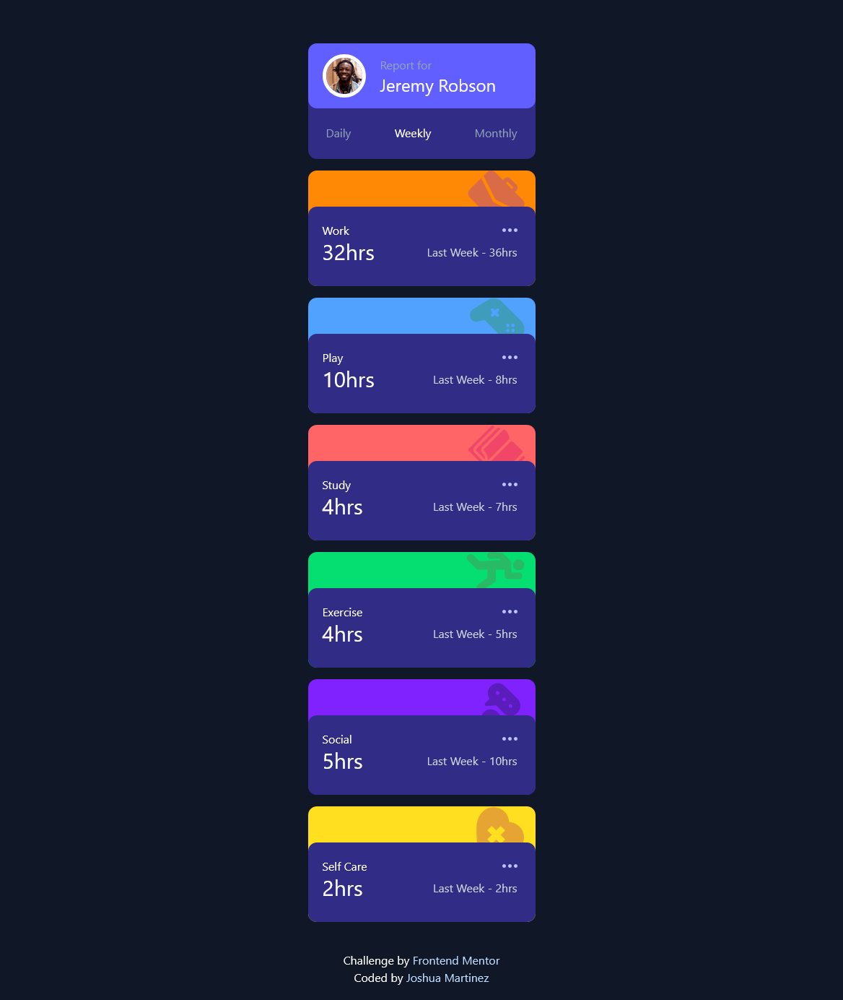
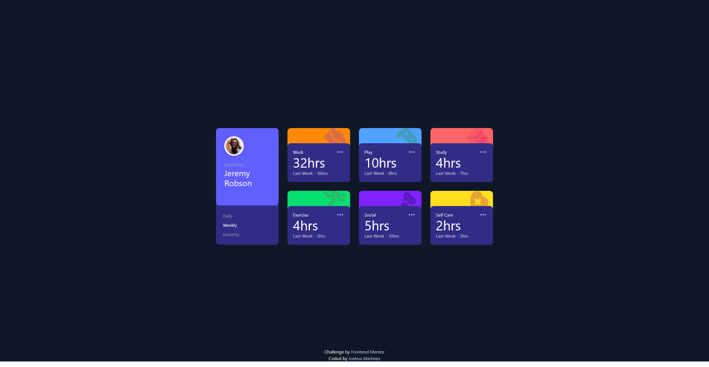

# Frontend Mentor - Time tracking dashboard solution

This is a solution to the [Time tracking dashboard challenge on Frontend Mentor](https://www.frontendmentor.io/challenges/time-tracking-dashboard-UIQ7167Jw). Frontend Mentor challenges help you improve your coding skills by building realistic projects. 

## Table of contents

- [Overview](#overview)
  - [The challenge](#the-challenge)
  - [Screenshot](#screenshot)
  - [Links](#links)
- [My process](#my-process)
  - [Built with](#built-with)
  - [What I learned](#what-i-learned)
  - [Continued development](#continued-development)
  - [Useful resources](#useful-resources)
- [Author](#author)

## Overview

### The challenge

Users should be able to:

- View the optimal layout for the site depending on their device's screen size
- See hover states for all interactive elements on the page
- Switch between viewing Daily, Weekly, and Monthly stats

### Mobile Layout



### Desktop Layout



### Links

- Live Site URL: [Vercel](https://time-tracking-dashboard-zeta-plum.vercel.app/)

## My process

### Built with

- Semantic HTML5 markup
- Tailwind CSS
- Flexbox
- CSS Grid
- Mobile-first workflow
- [React](https://reactjs.org/) - JS library


### What I learned
```css
<div className="flex items-center gap-5 bg-indigo-500 rounded-xl p-[20px] m-[-20px] max-h-[90px] xl:min-h-[280px] xl:flex-col xl:items-start xl:p-[30px]">
.
.
.
</div>
```
```js
function PeriodSelector() {
    return (
      <div className="flex justify-between xl:flex-col xl:items-start">
        <SelectorButton
          active={activePeriod === 'daily'}
          onClick={() => setActivePeriod('daily')}
        >
          Daily
        </SelectorButton>
        <SelectorButton
          active={activePeriod === 'weekly'}
          onClick={() => setActivePeriod('weekly')}
        >
          Weekly
        </SelectorButton>
        <SelectorButton
          active={activePeriod === 'monthly'}
          onClick={() => setActivePeriod('monthly')}
        >
          Monthly
        </SelectorButton>
      </div>
    )
  }

  function SelectorButton({active, onClick, children}) {
    return (
      <button
        onClick={onClick}
        className={`p-5px hover:bg-violet-500 ${active ? 'text-white font-medium' : 'text-slate-400'}`}
      >
        {children}
      </button>
    )
  }
.
.
.
  <PeriodSelector />
```
In this project, I learned a lot more about Tailwind CSS utility classes and how I can make an element ignore the styling properties of its parent element. Furthermore, I learned more about how props work in React and how you can add your own custom components or rather elements for rendering. I gained a lot of support from the FrontEnd mentor community and was able to refine my program to be more efficient as well as follow a more proper structure.

### Continued development
Going forward, I would like to make my program more efficient from the start rather than making "code bloat" first before cutting down later. This will help me save time and avoid any potential bugs. I would also like to learn about possible animations I can apply to my website such as allowing users to move the boxes to different cells within the grid.

### Useful resources

- [Tailwind CSS Docs](https://tailwindcss.com/docs/detecting-classes-in-source-files) - This helped with me with updating the styles for the boxes when using a .map() callback function to render them to the page.
- [StackOverflow Forum](https://stackoverflow.com/questions/46530534/can-a-javascript-ternary-operator-support-3-conditions) - This forum helped me understand how I could employ a ternary operator with 3 expressions to help with conditional rendering of 3 values.
- [StackOverflow Forum](https://stackoverflow.com/questions/4296530/ignore-parent-padding) - This forum helped me understand styling techniques where I would like a child element to ignore the styling properties assigned by it's parent such as padding.

## Author

- Frontend Mentor - [@JoshuaM04](https://www.frontendmentor.io/profile/@JoshuaM04)
